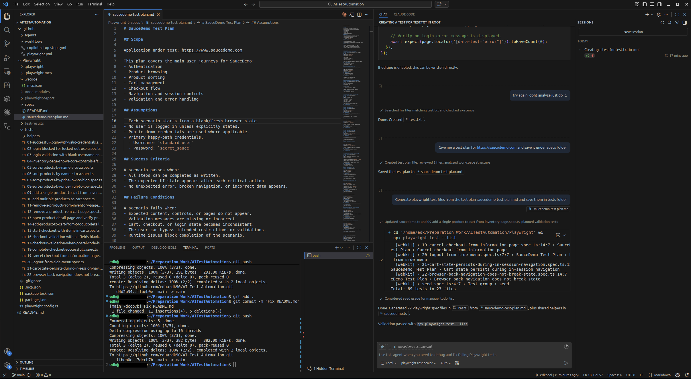

# AI-Test-Automation

A modern test automation framework built with **Playwright** and **GitHub Copilot agents**, designed to validate end-to-end user flows with minimal manual maintenance. This project demonstrates how AI-assisted testing can scale quality assurance across complex web applications.

---

## Screenshot



---

## What This Project Does

This framework automates end-to-end testing of a full e-commerce web application (SauceDemo) covering:

- **Authentication** — valid login, locked-out users, blank field validation
- **Inventory & Navigation** — product listing, sorting (A–Z, Z–A, price low/high)
- **Cart Management** — add/remove single and multiple products, cart state persistence across navigation
- **Checkout Flow** — full happy path, field validation, postal code edge cases, cancellation at each step
- **Product Detail Pages** — open, verify, add to cart from detail view
- **Session & Browser Behavior** — session persistence, browser back navigation integrity
- **Logout** — side menu logout flow

22 test specs. All written in TypeScript. All runnable in CI via GitHub Actions.

---

## How AI Is Used

This project goes beyond standard Playwright scripting by integrating **GitHub Copilot agents** directly into the testing workflow:

- **`.playwright-mcp/`** — MCP (Model Context Protocol) server integration, allowing Copilot to interact with the browser programmatically. This enables agents to reason about UI state, generate test actions, and assist in exploratory testing.
- **`agents/`** — Custom agent definitions that can autonomously navigate, interact, and validate application behavior.
- **`specs/saucedemo-test-plan.md`** — AI-generated test plan used as the source of truth for what scenarios to cover.
- **`mcp.json`** — Configuration for the MCP server connecting GitHub Copilot to the Playwright browser context.

The result: test coverage that is faster to write, easier to extend, and capable of adapting to UI changes with AI assistance.

---

## Tech Stack

| Tool | Purpose |
|---|---|
| Playwright | Browser automation & test runner |
| TypeScript | Type-safe test authoring |
| GitHub Actions | CI/CD pipeline |
| MCP (Model Context Protocol) | AI-to-browser communication layer |
| GitHub Copilot | Test generation & exploratory assistance |

---

## Running Tests
```bash
# Install dependencies
cd Playwright
npm install

# Install browsers
npx playwright install --with-deps

# Run all tests
npx playwright test

# Run with UI mode
npx playwright test --ui

# Run a specific spec
npx playwright test tests/18-complete-checkout-successfully.spec.ts
```

---

## CI/CD

Tests run automatically on every push and pull request to `main`/`master` via GitHub Actions. The HTML report is uploaded as a build artifact after each run for review without needing a local environment.

---

## Why This Approach

Traditional test automation breaks when UIs change and requires constant manual upkeep. By combining Playwright's reliability with AI agents via MCP, this framework can:

- Generate new test cases from a plain-text test plan
- Explore application flows autonomously
- Reduce the time between feature delivery and test coverage

This is how modern QA scales.